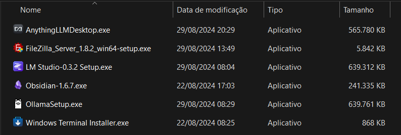
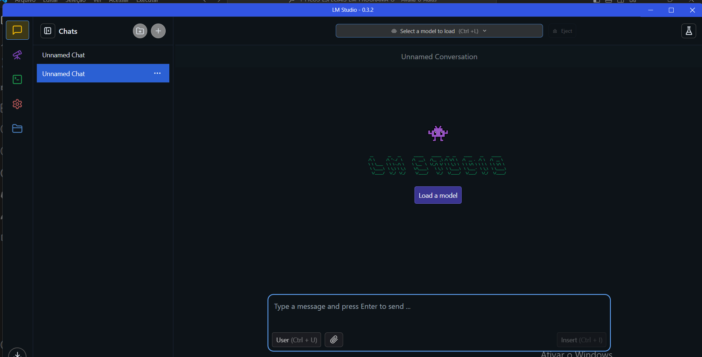
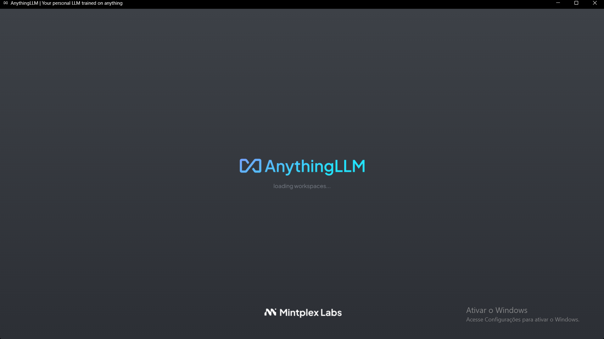
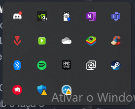

# Passo a Passo: Modelos LLM, Hugging Face e Ollama

## 1. Finalizar Exemplo Docker
   - Complete o exemplo anterior sobre o uso do Docker.

## 2. Baixar Ferramentas
**Utilizado do repositório passado em aula, porém pode ser baixado direto no site oficial**

   - **Baixar LLM Studio**:
     - Acesse o site oficial ou repositório do LLM Studio e faça o download da ferramenta.
    

   - **Baixar Anything LLM**:
     - Acesse o repositório oficial ou site do Anything LLM e baixe a versão mais recente.
     
   - **Baixar Ollama**:
     - Entre no site do Ollama ou no repositório GitHub e faça o download da ferramenta.
     

## 3. Baixar Modelos
   - Após baixar as ferramentas, baixe os modelos LLM que deseja utilizar.
   - Salve os modelos baixados na seguinte pasta do seu sistema:
     ```bash
     C:\Users\<SEU_USUARIO>\.cache\lm-studio\models
     ```

## 4. Conhecer os Detalhes dos Modelos
   - Após baixar e configurar os modelos, estude suas especificações e detalhes.
     - Verifique a documentação de cada modelo.
     - Entenda suas capacidades e como podem ser usados no desenvolvimento de aplicações.