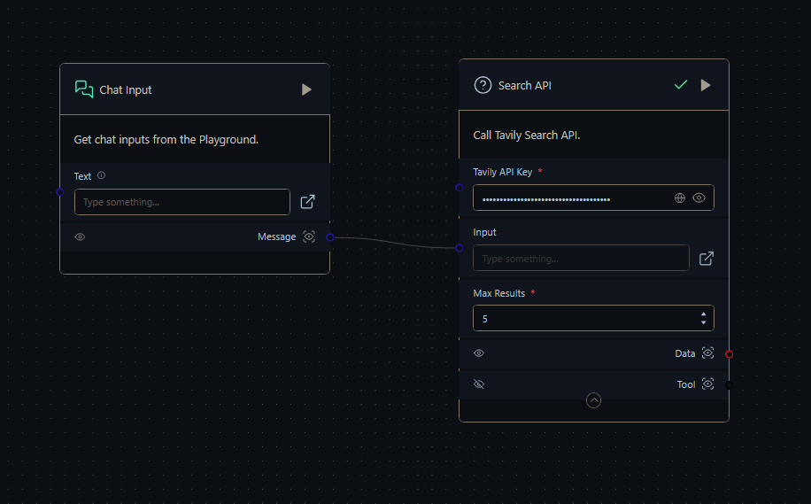
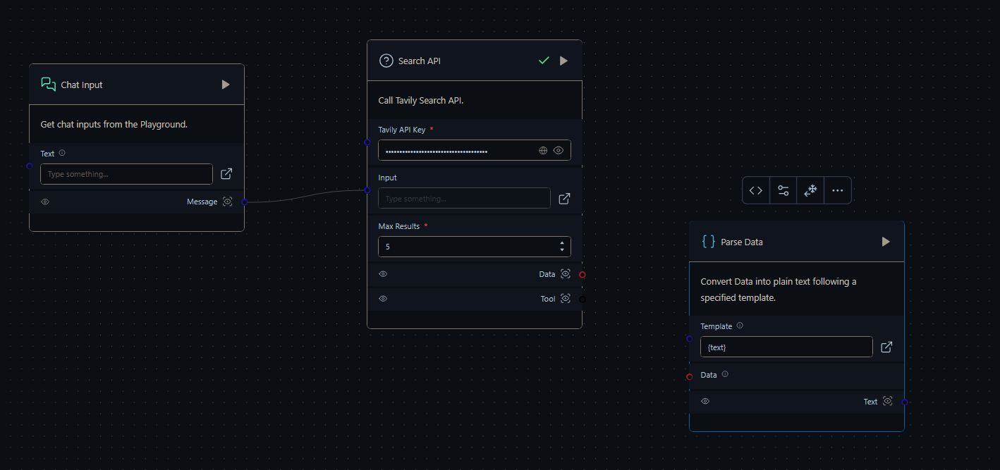
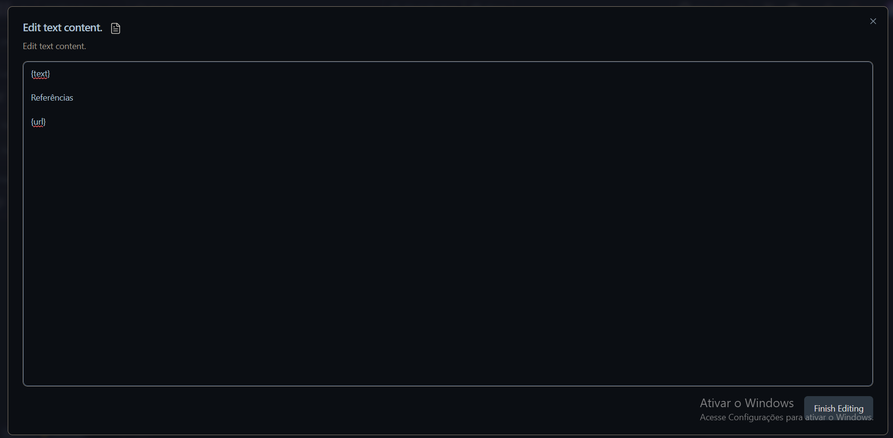
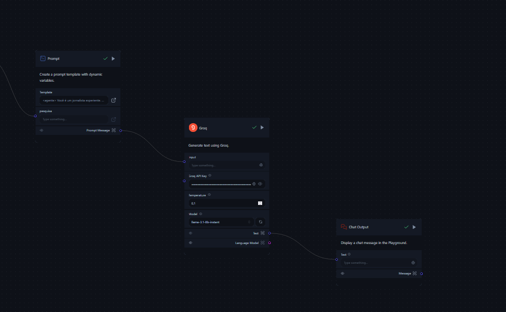
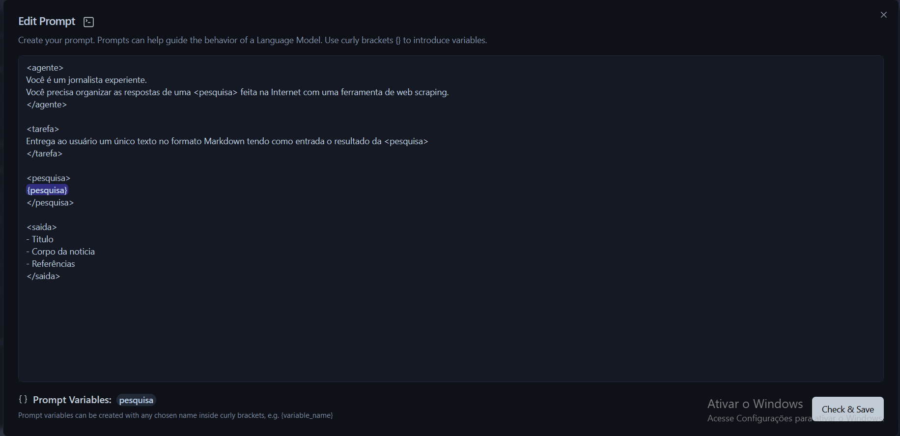
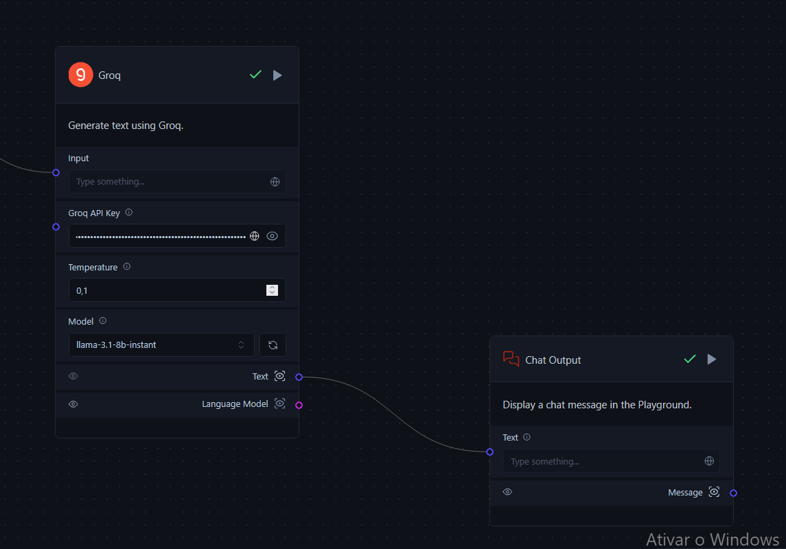

## Aula 4 e 5 Benevid 

### Screenshots

Interando serviço de api(tavily) com o langflow

Criação do fluxo entre um chat input (inserção de prompt) para a pesquisa na api

Parse data adicionado ao fluxo

adicionado ao codigo

parse data ajustado para ser o corpo da mensagem

como ela deve se comportar quando for executada, escrito em XML

api do groq utilizada como metodo de pesquisa e o output da mensagem