Aqui está o passo a passo da **Aula 4 e 5** com base nas screenshots fornecidas:

---

## Passo a Passo: Aula 4 e 5 - Benevid

### 1. Integração do Serviço de API (Tavily) com Langflow
Nesta etapa, foi feita a integração do serviço Tavily API ao Langflow. Confira a imagem abaixo para o processo visual:

---

### 2. Criação do Fluxo de Input de Pesquisa
Foi criado um fluxo de input de chat que permite a inserção de prompts para realizar pesquisas na API integrada.

---

### 3. Adicionando o Componente "Parse Data"
O componente de parse data foi adicionado ao fluxo, permitindo manipular as respostas da API.

---

### 4. Ajuste no Código: Parse Data como Corpo da Mensagem
O código foi ajustado para que o **parse data** seja utilizado como o corpo da mensagem para a pesquisa.

---

### 5. Comportamento Esperado da Pesquisa na API
Aqui está a demonstração de como a API deve se comportar ao ser executada.

---

### 6. Uso da API do Groq como Método de Pesquisa e Output da Mensagem
Foi utilizada a API do Groq como método de pesquisa, e aqui está o resultado gerado.

---

### 7. Configuração do Astra DB com API e Token
Foi configurada a API e o token da Astra DB dentro do fluxo. Abaixo, está a imagem demonstrando como foi feito:
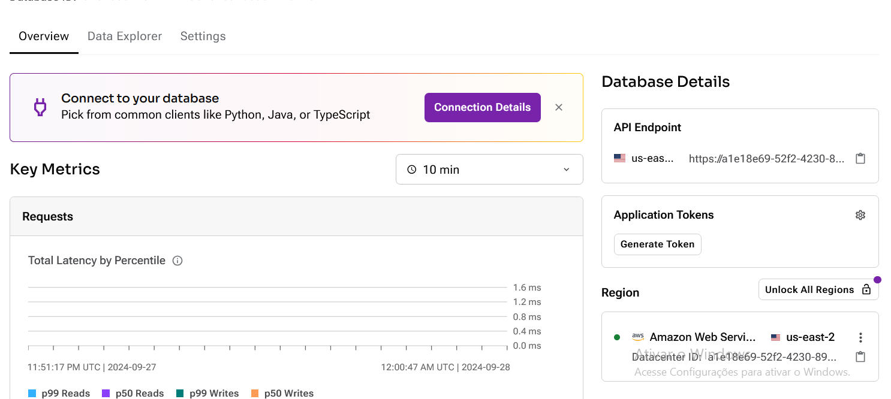

---

### 8. Configuração do Componente Astra DB para PDF
O fluxo foi configurado para fazer upload de arquivos PDF no banco de dados Astra DB. Veja a configuração completa:
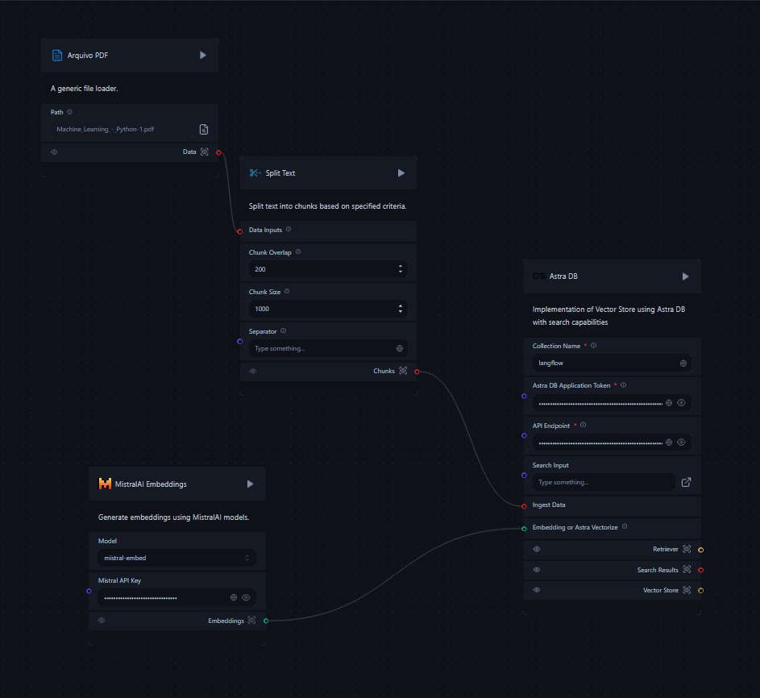

---

### 9. PDF Após Parse no Banco Astra DB
Depois de rodar o fluxo e dividir o PDF no banco de dados, o resultado foi visualizado conforme abaixo:
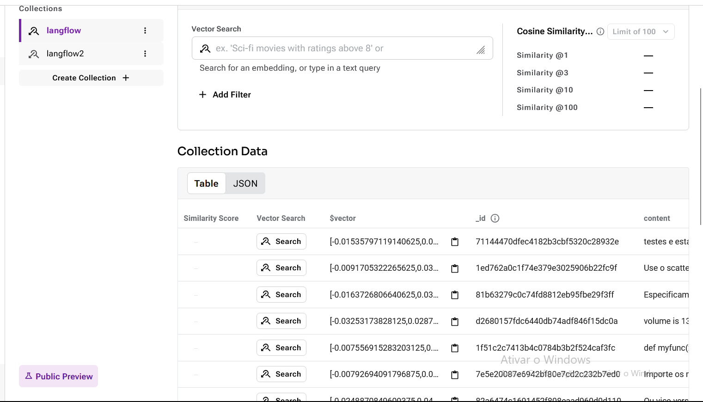

---

### 10. Definição da API e Configuração Inicial do Groq
Foi definida a API e as configurações iniciais do modelo Groq, conforme ilustrado na imagem:
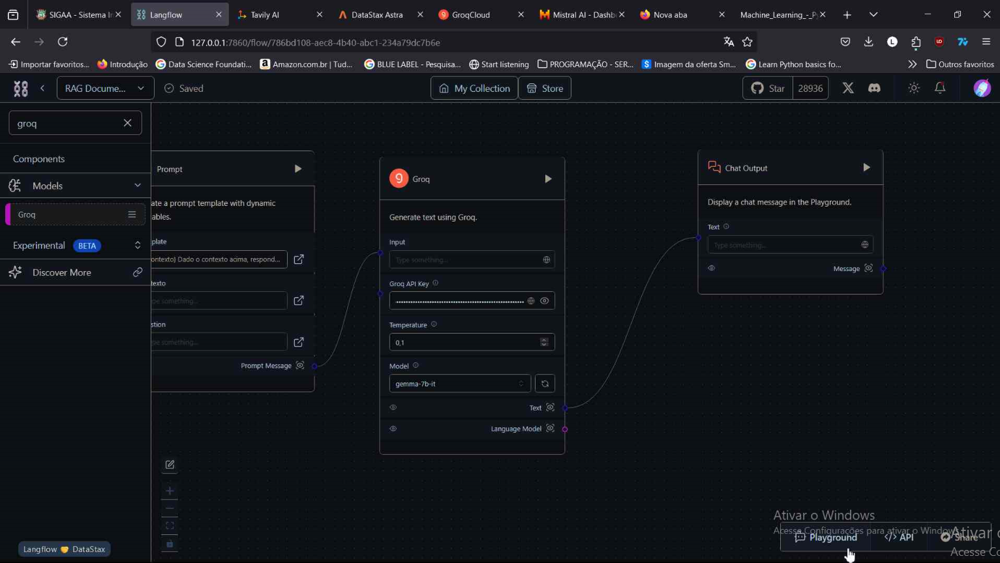

---

### 11. Pesquisa no Astra DB Utilizando PDF
Nos primeiros testes, foi feito uma pesquisa dentro do PDF que já estava no banco Astra DB, buscando pela palavra "variância".
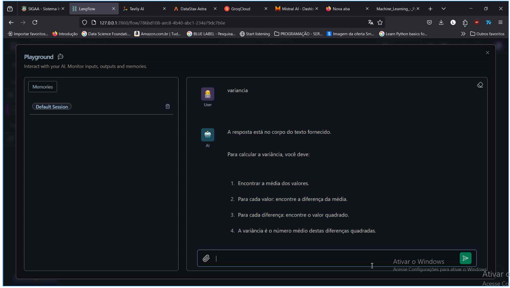

---

### 12. Resultado da Pesquisa de "Variância" no PDF
Aqui está o ponto exato no PDF onde a palavra "variância" foi encontrada.
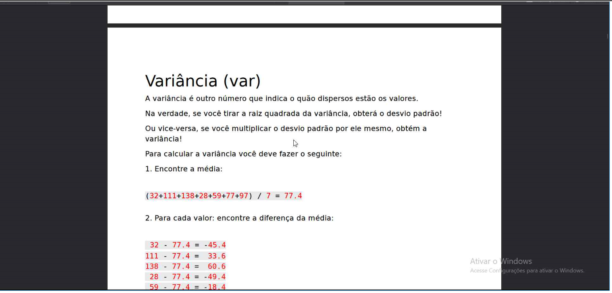

---

### 13. Integração do Mistral com Groq
Foi configurado um fluxo utilizando **Mistral** (API gerada no site) e **Groq** para realizar a pesquisa de palavras como mostrado anteriormente.
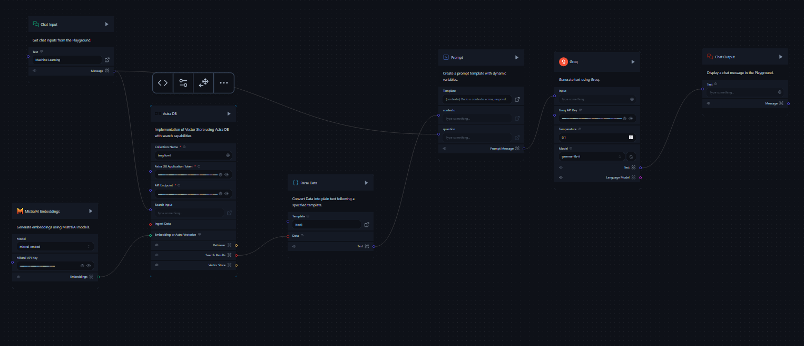

---

### 14. Fluxo do Crew AI
Durante a aula, foi apresentado o fluxo do **Crew AI**, que permite a formatação de notícias e pesquisas com agentes iterativos.
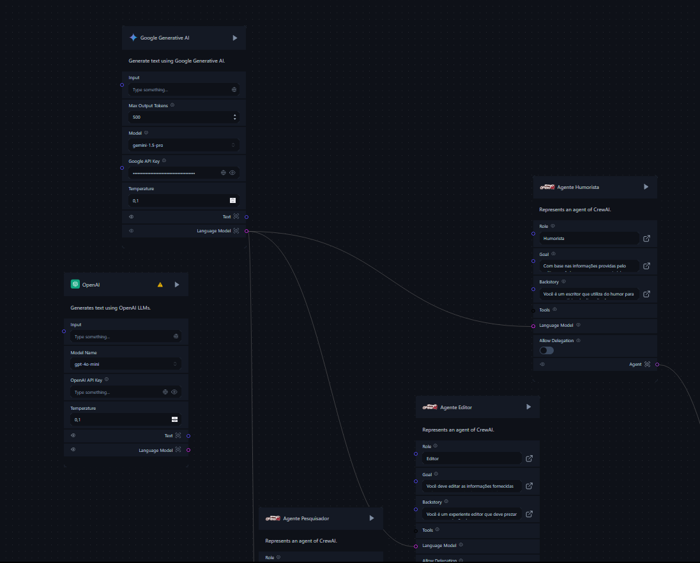

---

### 15. Exemplo de Prompt do Agente Humorista
Aqui está o exemplo de prompt do agente "Humorista", que formata as notícias com um tom mais humorístico.
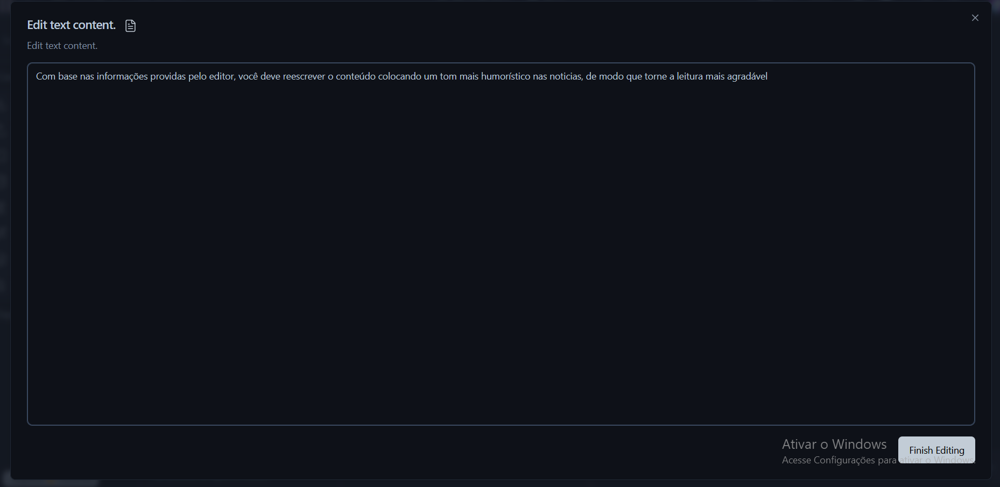

---

### 16. API Google Studio para Crew AI
Mostrando como a API do Google AI Studio foi obtida e utilizada no exemplo do Crew AI.
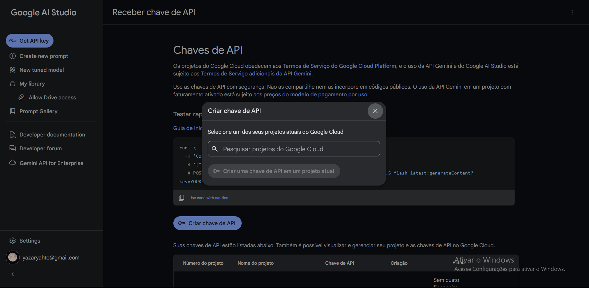

---

### 17. Instalação do Docker e Dify no WSL
Foram seguidos os passos para instalar o **Docker** e o **Dify** no WSL.
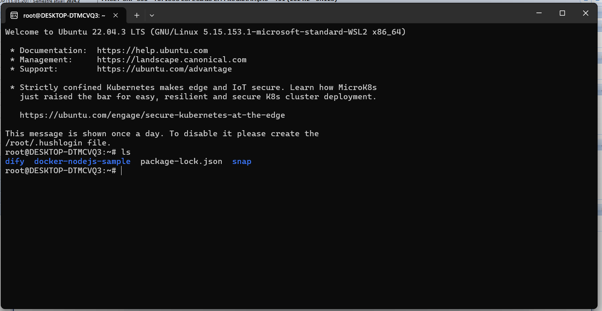

---

### 18. Conteúdo da Pasta Dify
Aqui está o conteúdo da pasta Dify, onde já contém o **nginx** configurado no arquivo **.env**.
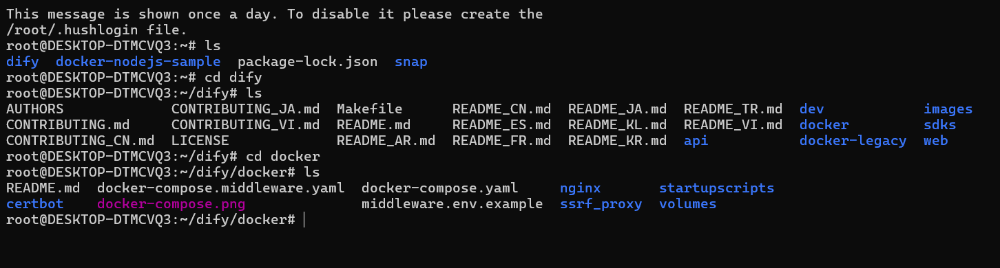

---

### 19. Configuração da Porta do Nginx no Arquivo .env
A porta do **nginx** foi configurada para 8080 e 8443, e também foi definida a senha do administrador no arquivo **init**.
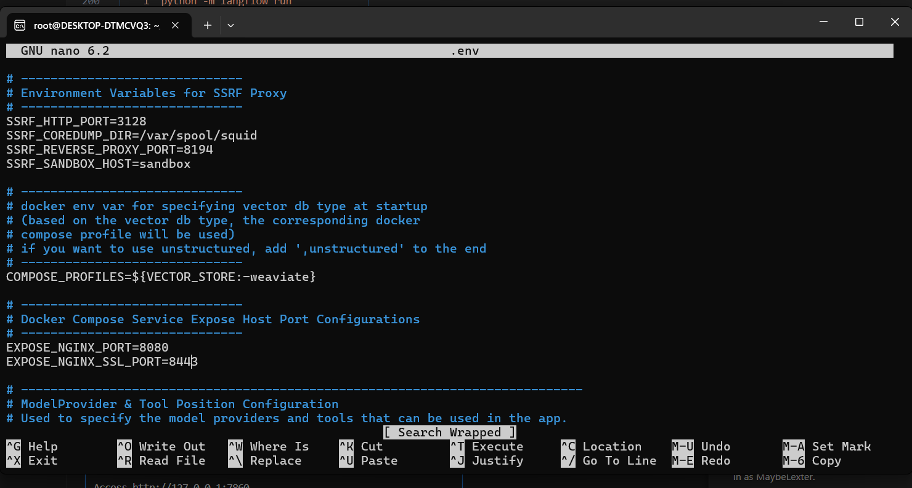

---

### 20. Comando para Inicializar o Dify
Este é o comando utilizado para inicializar o **Dify** e baixar os componentes necessários.
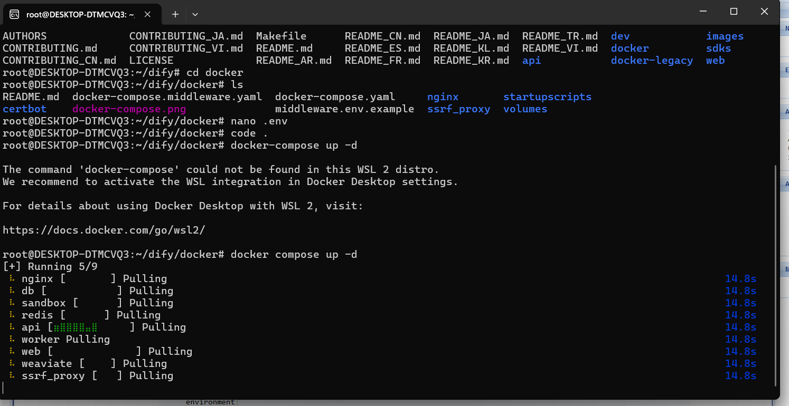

---

### 21. Painel Inicial do Dify
Após a instalação, o **Dify** foi conectado ao PC, e o painel inicial foi visualizado.
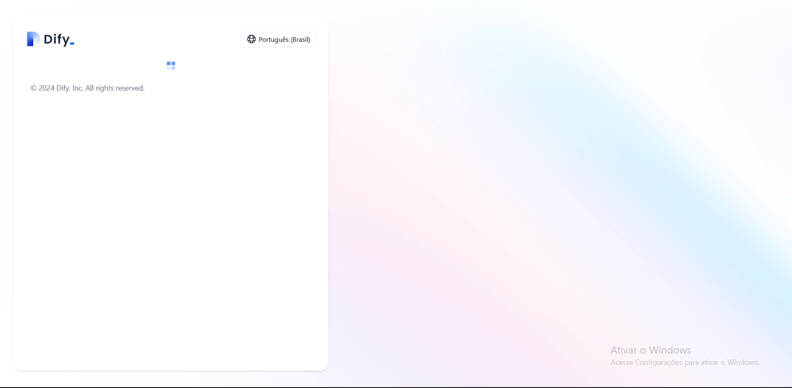

---

Esses são os principais passos demonstrados durante a **Aula 4 e 5**.